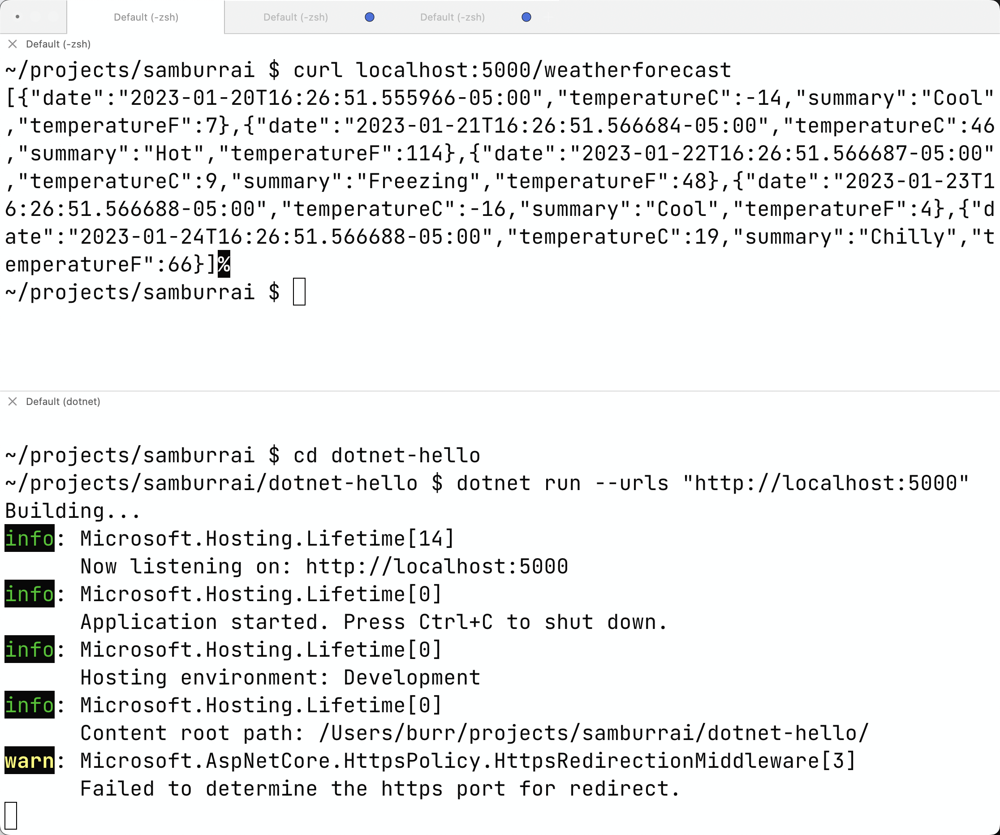

Install the [dotnet CLI](https://dotnet.microsoft.com/en-us/download/dotnet) 6.0


```
dotnet --version
6.0.405
```

```
dotnet --list-runtimes
Microsoft.AspNetCore.App 6.0.13 [/usr/local/share/dotnet/shared/Microsoft.AspNetCore.App]
Microsoft.NETCore.App 6.0.13 [/usr/local/share/dotnet/shared/Microsoft.NETCore.App]
```

To start from scratch

```
dotnet new webapi -minimal -o dotnet-hello -f net6.0

cd dotnet-hello

dotnet run --urls "http://localhost:5000"

curl localhost:5000/weatherforecast
```




### Supporting documentation

https://learn.microsoft.com/en-us/training/modules/build-web-api-aspnet-core/1-introduction

https://docs.microsoft.com/en-us/aspnet/core/tutorials/first-web-api?view=aspnetcore-6.0&tabs=visual-studio-mac

https://docs.microsoft.com/en-us/aspnet/core/test/hot-reload?view=aspnetcore-6.0

https://docs.microsoft.com/en-us/aspnet/core/tutorials/web-api-help-pages-using-swagger?view=aspnetcore-6.0
